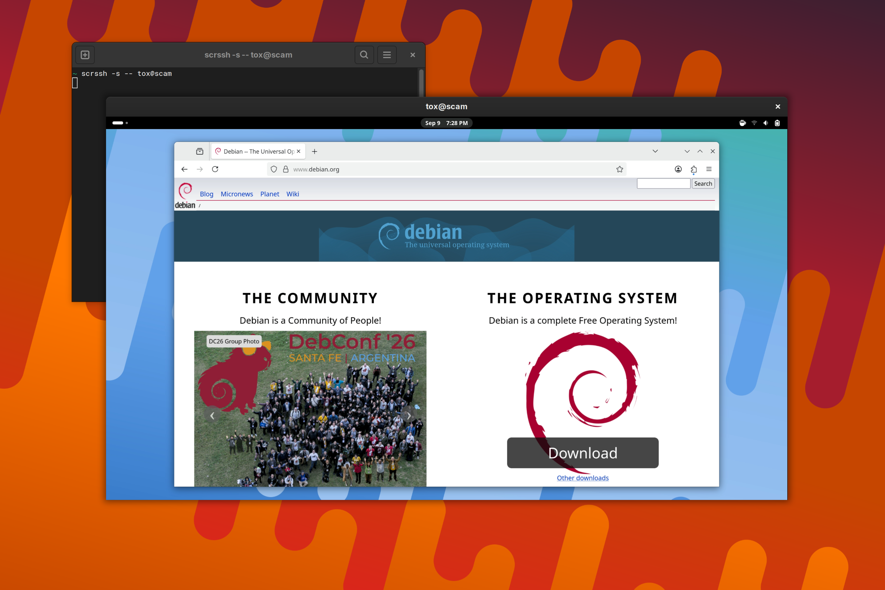
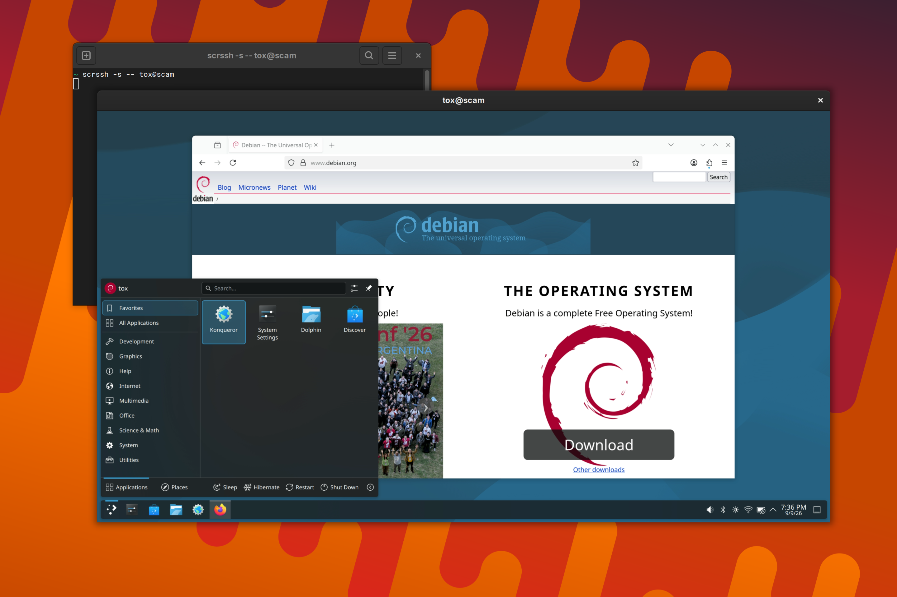
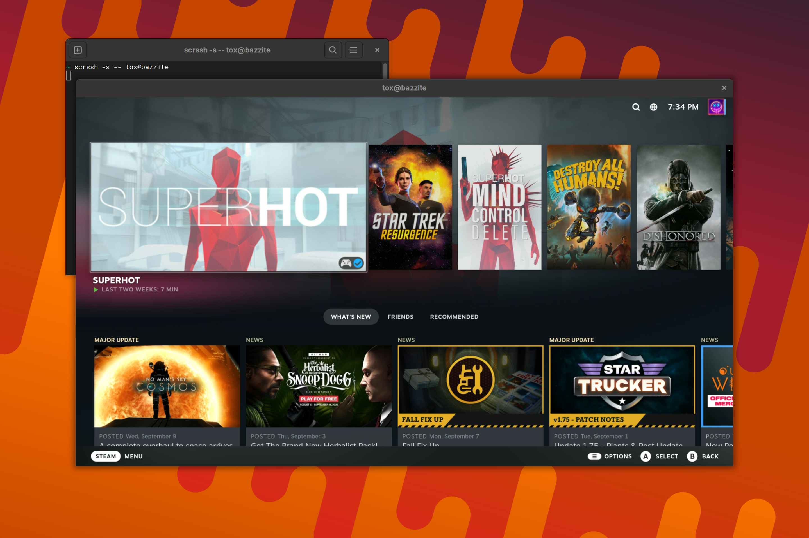
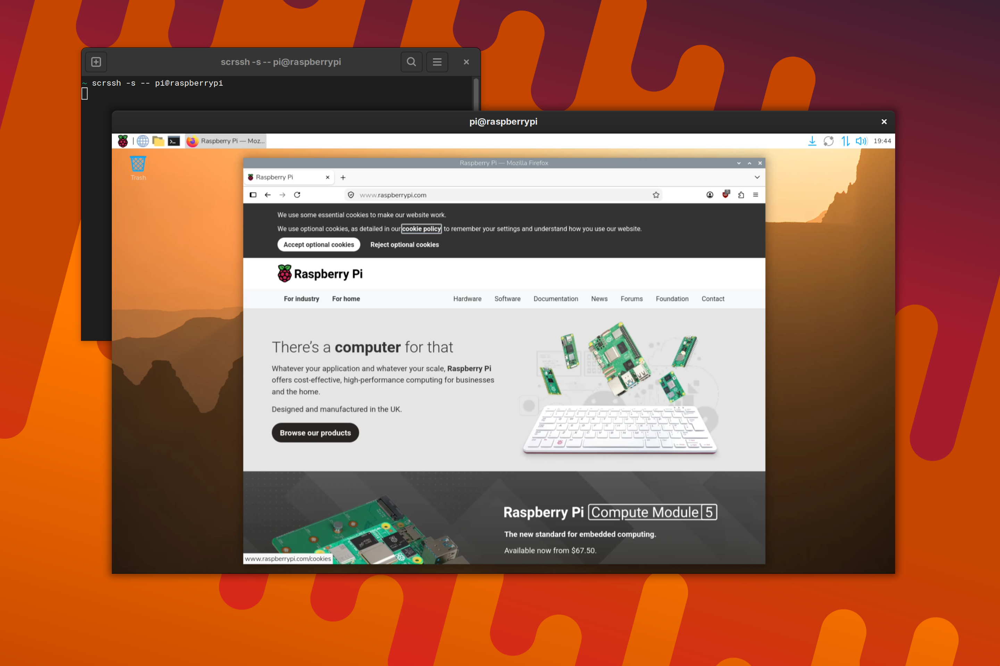

# scrssh

Viable TeamViewer/RustDesk alternative for Linux in under 1500 lines of C and
Python. `scrcpy` for the Linux admin.

*scrssh* lets you view and control remote desktops and servers over SSH. Nothing
is installed on the remote host and no daemon is left behind: the agent is a
Python script that *scrssh* pipes over the connection, and it exits with the
session. From command line to desktop takes about two seconds.

## Usage

```
usage: scrssh [options] [--] <ssh arguments...>
https://codeberg.org/Gottox/scrssh

options:
  -B <RATE>  capped bitrate             [default: 10M]
  -C <N>     capture a specific CRTC
  -F         start in fullscreen mode   [hotkey: LAlt LAlt F]
  -P <N>     capture a specific plane
  -a         run the agent under `doas -n`
  -d <PATH>  DRM device to capture      [default: /dev/dri/card0]
  -e <NAME>  force an encoder           [default: ask the host]
             h264_vaapi, h264_nvenc, h264_v4l2m2m, libx264
  -f <N>     capture frame rate         [default: 30]
  -m <RES>   cap the capture at <W>x<H> [default: this display]
             either side may be left out, 0 caps nothing
  -s         run the agent under `sudo -S`
  -u         run the agent under `su -T`
  -h         show this help
```

Everything after the options is handed to `ssh`, so jump hosts, custom ports,
control masters and the rest of your `ssh_config` work as they always do:

```bash
scrssh user@example.com
scrssh -- -p 2222 -J user@jumphost.com user@example.com
```

Capturing the screen needs `CAP_SYS_ADMIN`. If you cannot log in as root, `-s`
runs the agent under `sudo`, `-a` under `doas` and `-u` under `su`:

```bash
scrssh -s -- -p 2222 user@example.com
```

## Hotkeys

Every key press is forwarded to the remote host, so *scrssh* hides its own
shortcuts behind a prefix: tap `Left Alt` twice within half a second, then
press the command key within the next two seconds.

* `LAlt LAlt F`: toggle fullscreen, the same state as `-F`

## Requirements

On the host:

1. `sshd` running
2. ffmpeg and python installed
3. `libEGL`, `libGLESv2` and `libgbm`, which come with every GPU driver
4. `CAP_SYS_ADMIN`, that is root or `-s`
5. a screen or an HDMI dummy plug connected

On the client:

1. `ssh`
2. `scrssh`

## Capture

The agent imports the scanout buffer into EGL with
`EGL_EXT_image_dma_buf_import_modifiers`, converts it to NV12 with a small
OpenGL ES shader, reads the planes back and pipes the frames to ffmpeg. The
GPU driver resolves tiling and render compression on the way, so linear,
tiled and compressed framebuffers all come out the same, and the encoders get
the format they want without a CPU conversion. All of this needs only the
`libEGL`, `libGLESv2` and `libgbm` that ship with every GPU driver.

## Encoders

The host picks the encoder itself, trying each in turn and keeping the first
one that produces a frame:

* `h264_vaapi`: AMD and Intel
* `h264_nvenc`: NVIDIA
* `h264_v4l2m2m`: Raspberry Pi
* `libx264`: software

`-e` forces one and skips the search:

```bash
scrssh -e libx264 user@example.com
```

## Troubleshooting

> ```
> the framebuffer is not accessible; capturing needs root
> the remote stream contains no video
> ```

The remote host does not have the required permissions. Either log in as root
or add `-s` to run the agent under `sudo`.

> ```
> the remote video stream ended
> ```

The screen changed its resolution; scrssh does not support mode switches
during a session.

> ```
> doas: Authentication required
> the remote agent did not start
> ```

When using `-a` make sure `doas` on the remote host is configure to permit the
`python3` command without prompting for a password or, preferably, use `-s` to use `sudo`
escalation instead.

> ```
> [Errno 2] No such file or directory: 'ffmpeg'
> the remote stream contains no video
> ```

The remote host does not have `ffmpeg` installed.

> ```
> libEGL.so.1: cannot open shared object file: No such file or directory
> the remote stream contains no video
> ```

The host has no EGL. Install the GPU driver packages that provide `libEGL`,
`libGLESv2` and `libgbm`; on Debian those are `libegl1`, `libgles2` and
`libgbm1`.

## License

*scrssh* is released under the GNU General Public License, version 2. See
[LICENSE](./LICENSE) for the full text.

## Screenshots

Debian Gnome:



Debian KDE Plasma:



Works on Bazzite:



Works even on the Raspberry Pi 2:


