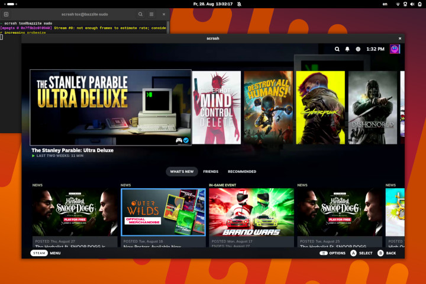
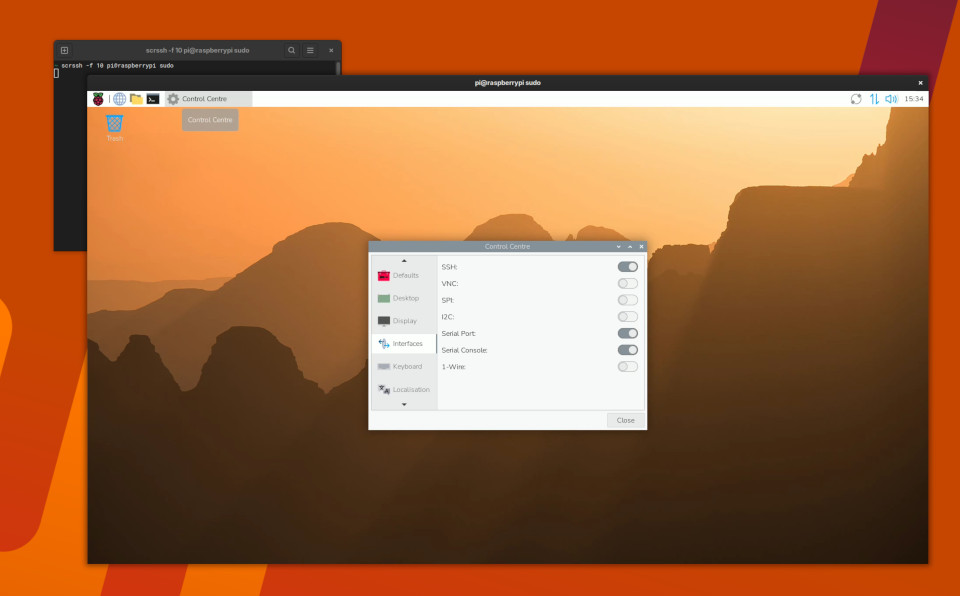

# scrssh

Viable TeamViewer/RustDesk alternative for Linux in under 1000 lines of C and
Python. `scrcpy` for the Linux admin.

scrssh lets you view and control remote desktops and servers over SSH. Nothing
is installed on the remote host and no daemon is left behind: the agent is a
Python script that scrssh pipes over the connection, and it exits with the
session. From command line to desktop takes about two seconds.

Works on Bazzite:



Works even on the Raspberry Pi 2:



## Usage

```
usage: scrssh [options] [--] <ssh arguments...>
https://codeberg.org/Gottox/scrssh

options:
  -s         run the agent under `sudo -S`
  -d <PATH>  DRM device to capture      [default: /dev/dri/card0]
  -C <N>     capture a specific CRTC
  -P <N>     capture a specific plane
  -f <N>     capture frame rate         [default: 30]
  -B <RATE>  capped bitrate             [default: 500K]
  -e <NAME>  force an encoder           [default: ask the host]
             h264_vaapi, h264_nvenc, h264_v4l2m2m, libx264
  -h         show this help
```

Everything after the options is handed to `ssh`, so jump hosts, custom ports,
control masters and the rest of your `ssh_config` work as they always do:

```bash
scrssh user@example.com
scrssh -- -p 2222 -J user@jumphost.com user@example.com
```

Capturing the screen needs `CAP_SYS_ADMIN`. If you cannot log in as root, `-s`
runs the agent under `sudo`:

```bash
scrssh -s -- -p 2222 user@example.com
```

## Requirements

On the host:

1. `sshd` running
2. ffmpeg and python installed
3. `CAP_SYS_ADMIN`, that is root or `-s`
4. a screen or an HDMI dummy plug connected

On the client:

1. `ssh`
2. `scrssh`

## Encoders

The host picks the encoder itself, trying each in turn and keeping the first
one that produces a frame:

* `h264_vaapi`: AMD and Intel
* `h264_nvenc`: NVIDIA
* `h264_v4l2m2m`: Raspberry Pi
* `libx264`: software

`-e` forces one and skips the search:

```bash
scrssh -e libx264 user@example.com
```

## Troubleshooting

> ```
> [in#0 @ 0x5566dacb3f80] No handle set on framebuffer: maybe you need some additional capabilities?
> [in#0 @ 0x5566dacb3c80] Error opening input: Invalid argument
> Error opening input file -.
> Error opening input files: Invalid argument
> [mpegts @ 0x7f939c010940] Could not detect TS packet size, defaulting to non-FEC/DVHS
> the remote stream contains no video
> ```

The remote host does not have the required permissions. Either log in as root
or add `-s` to run the agent under `sudo`.

> ```
> [in#0 @ 0x560f3e28ff80] Framebuffer pixel format 30334241 is not a known supported format.
> [in#0 @ 0x560f3e28fc80] Error opening input: Invalid argument
> ```

The framebuffer is 10 bit. Disable HDR on the remote host.

> ```
> [in#0/kmsgrab @ 0x5617da113f00] Plane 79 framebuffer format changed: now 34325258.
> [in#0/kmsgrab @ 0x5617da113c00] Error during demuxing: Input/output error
> the remote video stream ended
> ```

scrssh does not support mode switches during a session.
